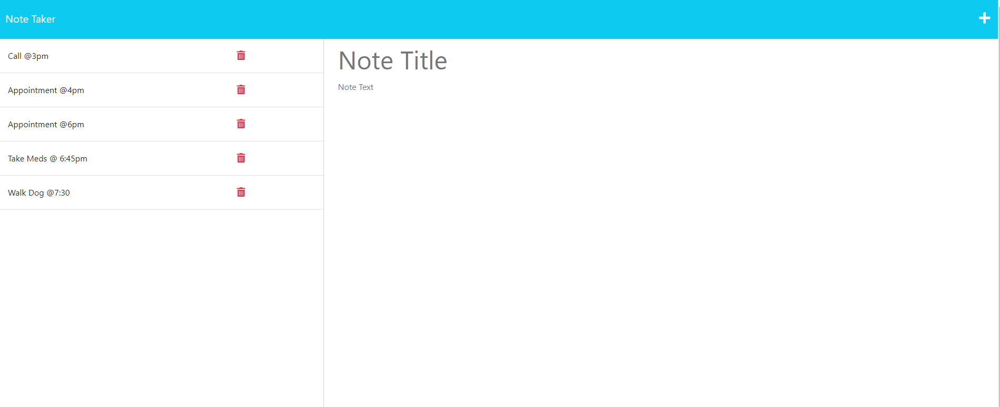

# Las Notes!

Las Notes is a note taking application that helps with keeping track of your busy busy schedule.  
Create new notes and save them to your local database so that you never lose them even when closing out of the 
application! After completing a note, complete it by deleting the note from your tracked notes. 
***

## Depoloyment

This page was deployed by using Heroku! Feel free to visit the deployed page [here](https://stark-oasis-08184.herokuapp.com/) and start taking your own notes!
***

## Main Menu 

***

## Notes

### This app was created using HTML, CSS, JavaScript, Node, and Express!
***

## License

Please refer to the license in the repository.
***

## Thank you!

